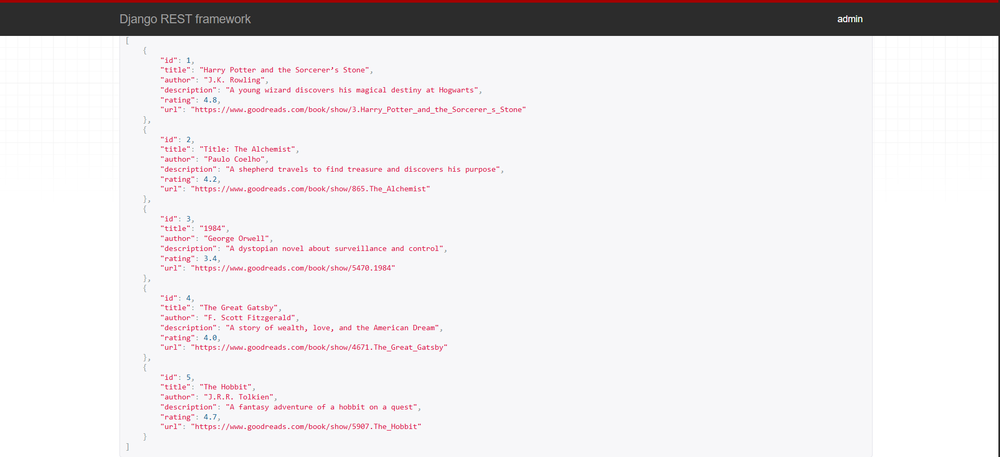
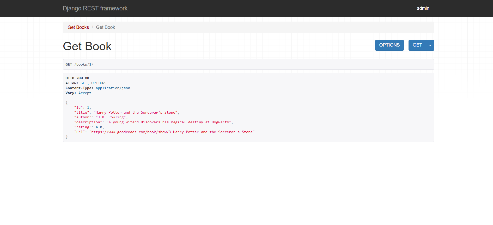
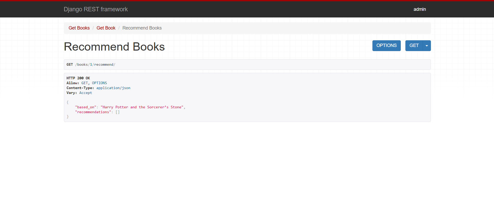
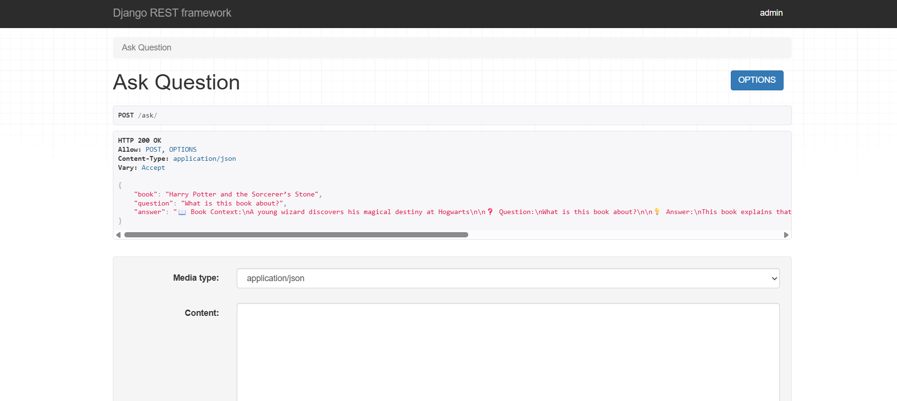

# Booksy – Book Knowledge System

This is a Django backend project.

## Features
- View books
- View book details
- Get recommendations
- Ask questions about books

## Tech Used
- Django
- Django REST Framework

## How to run
1. Install requirements
2. Run server using:
python manage.py runserver

## API Endpoints
- /books/
- /books/<id>/
- /books/<id>/recommend/
- /ask/

## Screenshots

### Books List

### Book Detail

### Recommendations

### Q&A Result

